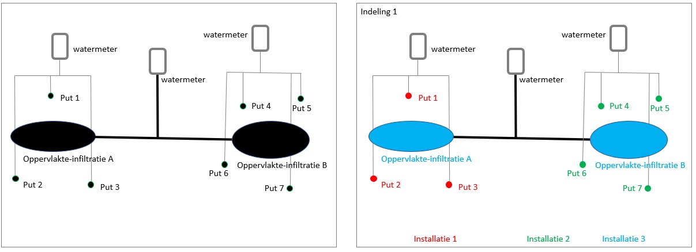
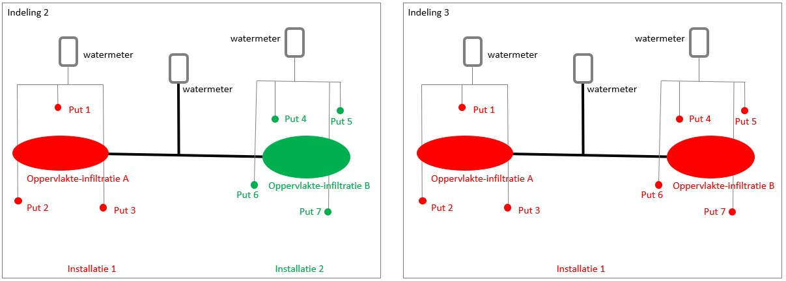

Grondwaterproductiedossier
===================

Inleiding grondwatergebruik
----------------------------------

Grondwater is een belangrijke bestaansbron. Voor uiteenlopende doelen wordt actief gebruik gemaakt van grondwater. Deels richt het gebruik zich op het grondwater zelf, maar bij ondiepe bodemenergie richt het gebruik zich ook op het warmte-leverend en -bufferend vermogen van de ondergrond en het zich daarin bevindende grondwater. Een goed zicht op het huidige gebruik van grondwater -in samenhang met het monitoren van grondwaterstanden en stijghoogtes- helpt om de effecten ervan te begrijpen en om nieuwe gebruiksaanvragen te kunnen beoordelen en zodoende het grondwater als belangrijke bestaansbron duurzaam te beschermen en beheren. Het registratiedomein Grondwatergebruik richt zich op de registratie en ontsluiting van informatie over de technische systemen die grondwater benutten. De belangrijkste focus in de gegevensdefinitie ligt daarbij op de locatie en diepte van het systeem en op het gebruik (hoeveelheid water en energie) van het grondwater. Dit zijn de gegevens met directe hergebruikswaarde.

Het domein Grondwatergebruik valt uiteen in twee registratieobjecten: Grondwatergebruiksysteem (GUF) en Grondwaterproductiedossier (GPD), dit wordt in de volgende paragraaf nader toegelicht. Het gebruik van grondwater is via wet- en regelgeving sterk gereguleerd. Tot 2022 is de Waterwet het wettelijk kader, vanaf 2022 is dit de Omgevingswet. Juridisch wordt daarbij onderscheid gemaakt tussen “onttrekking”; waarmee het oppompen van grondwater wordt bedoeld, “infiltratie”; waarmee het in de bodem brengen van water met het oog op latere onttrekking wordt bedoeld en “lozing”; waarmee het in de bodem brengen van water wordt bedoeld, zonder dat sprake is van latere onttrekking. Deze laatste vorm van grondwatergebruik (lozing) is buiten scope geplaatst. Ook het gebruik van ondergrond en grondwater voor opslag en onttrekking van bodemenergie is wettelijk gedefinieerd in de genoemde wetten. Gegevens van systemen die dieper dan 500 meter onder maaiveld liggen, worden binnen het registratiedomein Mijnbouwwet onder de registratieobjecten Mijnbouwwetvergunning en Mijnbouwwetconstructie geregistreerd. Daarnaast bevat de registratie uitsluitend informatie over de ondergrond van Nederland en haar Exclusieve Economische Zone (EEZ). De EEZ is het gebied op de Noordzee waar Nederland economische rechten heeft.

De inhoud van registratieobject Grondwatergebruiksysteem is gestandaardiseerd en beschreven in de catalogus en het bijbehorende gegevensmodel, welke te vinden (zullen) zijn op: https://basisregistratieondergrond.nl/inhoud-bro/registratieobjecten/grondwatergebruik/guf/

Onder het registratieobject Grondwaterproductiedossier wordt de grondwater'productie' van een grondwatergebruiksysteem vastgelegd, d.w.z. de daadwerkelijk onttrokken of ingebrachte hoeveelheden grondwater (hierna 'grondwaterproductiecijfers'). Gegevens over het indirecte gebruik van grondwater voor de opslag of onttrekking van bodemenergie middels een gesloten bodemenergiesysteem worden niet in het grondwaterproductiedossier geregistreerd. De aanwezigheid van een reeds geregistreerd grondwatergebruiksysteem in de basisregistratie ondergrond is voorwaardelijk aan de registratie van grondwaterproductiecijfers, omdat ieder grondwaterproductiedossier naar één grondwatergebruiksysteem verwijst. De duur van het grondwatergebruik is niet bepalend voor het al of niet registreren van de grondwaterproductiecijfers. 

De regels omtrent de periodieke opgave van de grondwaterproductiecijfers richting bevoegd gezag zijn te vinden in artikel 6.11 van het Waterbesluit. Per 01-01-2022 geldt de Omgevingswet als juridisch kader. Welk onderdeel precies de relevante regels voor de grondwaterproductiecijfers zal bevatten, is op het moment van schrijven van deze catalogus nog niet bekend. Wel is helder dat Provincies, Waterschappen en Gemeenten en voor enkele specifieke situaties de Rijksoverheid (meer specifiek Rijkswaterstaat) als bevoegde gezagen in het grondwatergebruikdomein zijn aangewezen (Omgevingsbesluit art. 4.1.2 t/m 4.5). Vanuit die bevoegdheid leveren deze organisaties (of de door hen georganiseerde Omgevingsdiensten) zowel de informatie van grondwatergebruiksystemen als de grondwaterproductiedossiers aan. Het bronhouderschap voor BRO registratiedomein Grondwatergebruik is bij deze bevoegde gezagen belegd.

Voor het aanleveren van onttrokken of ingebrachte hoeveelheden grondwater gelden juridische voorschriften. Het werkveld heeft een uitwisselingsformaat voor deze gegevens ontwikkeld. Samen vormen de juridische voorschriften én de praktische werkafspraken het kader voor de registratie van onttrokken of ingebrachte hoeveelheden grondwater in de BRO. De voorliggende gegevensinhoud voldoet aan de eisen van een basisregistratie.

Het grondwaterproductiedossier kent een directe verwijzing naar één grondwatergebruiksysteem. De geografische en andere technische eigenschappen van het systeem zijn onderdeel van het registratieobject grondwatergebruiksysteem. Dat betekent dat in dit registratieobject uitsluitend de grondwaterproductiecijfers worden geregistreerd van grondwatergebruiksystemen die reiken tot een diepte van maximaal 500 meter beneden maaiveld.

De volledige scopeafbakening is beschreven in het Scopedocument Domein Grondwatergebruik (GU). Deze is te raadplegen op: https://basisregistratieondergrond.nl/inhoud-bro/registratieobjecten/grondwatergebruik/

Domein grondwatergebruik in de BRO
----------------------------------

Het domein grondwatergebruik in de basisregistratie ondergrond (BRO) omvat twee registratieobjecten:
-   Grondwatergebruiksysteem;
-   Grondwaterproductiedossier.

De voorliggende catalogus gaat over het registratieobject grondwaterproductiedossier.

In de technische landelijke voorziening van de basisregistratie ondergrond worden Engelstalige benamingen gehanteerd voor de registratieobjecten. Omwille van de aansluiting hiermee worden voor de registratieobjecten Engelstalige afkortingen gebruikt. In deze catalogus worden alleen de Engelstalige afkortingen en verder de Nederlandstalige termen gebruiken.
-   Grondwatergebruiksysteem wordt afgekort tot GUF (Groundwater Usage Facility);
-   Grondwaterproductiedossier wordt afgekort tot GPD (Groundwater Production Dossier).

<figure id='image002'>
  
  <figcaption>De mogelijke samenhang tussen de twee registratieobjecten Grondwatergebruiksysteem (GUF) en Grondwaterproductiedossier (GPD) binnen het domein Grondwatergebruik. Onder het IMBRO-regime heeft de inhoud van het grondwaterproductiedossier meestal betrekking op het installatie-niveau van GUF. Onder het IMBRO/A-regime hebben deze gegevens meestal betrekking op het niveau van grondwatergebruiksysteem van GUF. In het figuur is met dunne lijnen aangegeven dat onder het IMBRO-regime een klein deel van de inhoud van het grondwaterproductiedossier betrekking zal hebben op het grondwatergebruiksysteem-niveau van GUF. Een klein deel van inhoud van de grondwaterproductiedossiers onder het IMBRO/A-regime zal betrekking hebben op het installatie-niveau van GUF.</figcaption>
</figure>

Een grondwatergebruiksysteem betreft de constructie die gebruikt wordt om grondwater te onttrekken aan, en te brengen in de ondergrond. Ook zijn systemen opgenomen die niet direct gebruik maken van het grondwater zelf, maar die alleen indirect gebruik maken van het grondwater, namelijk van de warmtecapaciteit van het grondwater. Het registratieobject grondwatergebruiksysteem bevat gegevens die bij de vergunningverlening (in de beschikking) of in melding zijn vastgelegd over het ontwerp van het systeem. Daarnaast bevat dit registratieobject gegevens over het in de praktijk gerealiseerde systeem. Zowel de ontwerpinstallatie en haar onderdelen als de gerealiseerde installatie en haar onderdelen hebben een geometrie.

Een grondwaterproductiedossier omvat de gegevens van de periodieke opgave van de volumes (grond)water die over een zekere periode aan de ondergrond worden onttrokken of ingebracht. Deze gegevens worden op basis van een wettelijke plicht aan het bevoegd gezag gerapporteerd. Een grondwaterproductiedossier heeft zelf geen verticale positie en locatie maar bevat de relatie met de gerealiseerde installatie(s) waar de productiecijfers betrekking op hebben. Een grondwaterproductiedossier bevat daarmee indirect een locatie. Eén grondwaterproductiedossier kan relaties naar meerdere installaties bevatten waarbij deze installaties altijd onderdeel uitmaken van één grondwatergebruiksysteem. In het geval het historische gegevens van productiecijfers van een grondwatergebruiksysteem met meerdere installaties betreft, is vaak alleen bekend wat de productiecijfers van het gehele grondwatergebruiksysteem zijn, en is de uitsplitsing naar gerealiseerde installaties meestal niet bekend. In die gevallen wordt bij een grondwaterproductiedossier de relatie vastgelegd met het grondwatergebruiksysteem, en dus niet met de gerealiseerde installaties. Paragraaf 3.4 beschrijft de relatie tussen het grondwatergebruiksysteem en de grondwaterproductiecijfers van historische gegevens (IMBRO/A) in meer detail.

Een grondwaterproductiedossier en het grondwatergebruiksysteem waar dat grondwaterproductiedossier betrekking op heeft, vallen onder de verantwoordelijkheid van dezelfde bronhouder.

Inleiding grondwaterproductiedossier
----------------------------------

### Inleiding

Een *Grondwaterproductiedossier (GPD)* omvat de gegevens van de periodieke opgave van de volumes (grond)water die over een zekere periode aan de ondergrond worden onttrokken of ingebracht. Het grondwaterproductiedossier richt zich alleen op de feitelijk gebruikte hoeveelheid grondwater, gegevens met betrekking tot de opgeslagen en onttrokken warmte en koude (bij bodemenergiesystemen), zoals bijvoorbeeld temperatuurgegevens worden niet geregistreerd in het grondwaterproductiedossier. Het registratieobject grondwaterproductiedossier beantwoordt de vraag hoe het grondwater is gebruikt (onttrokken of ingebracht), hoeveel grondwater is gebruikt en in welke periode dat is geweest. De in de basisregistratie ondergrond te registreren informatie van grondwaterproductie ontstaat in het werkproces van de bevoegde gezagen. Paragraaf 3.2.2 beschrijft de opeenvolgende stappen van het proces waarin de gegevens ontstaan. Paragraaf 3.2.3 beschrijft een aantal belangrijke kenmerken van de gegevens over het grondwaterproductiedossier. 

### Het proces van gegevensverwerking

Het proces waarin gegevens van grondwatergebruiksystemen in de praktijk ontstaan, is schematisch weergegeven in de onderstaande figuur en wordt daaronder beschreven. 

<figure id='image003'>
  
  <figcaption>Het totstandkomingsproces van gegevens voor de registratieobjecten Grondwatergebruiksysteem (beige pijlen) en Grondwaterproductiedossier (rode pijlen) en de daarbij betrokken actoren.</figcaption>
</figure>

Ontwerpen van nieuw aan te leggen grondwatergebruiksystemen worden door initiatiefnemers middels een vergunningaanvraag of melding aan het bevoegd gezag kenbaar gemaakt. Wanneer de vergunningaanvraag of de melding door het bevoegd gezag positief is beoordeeld, worden de ontwerpgegevens door het bevoegd gezag aan de BRO aangeleverd en bij het registratieobject Grondwatergebruiksysteem geregistreerd. Het grondwatergebruiksysteem wordt daarna 'volgens ontwerp' aangelegd. Het bevoegd gezag schrijft voor dat bepaalde gegevens uit de realisatiefase door de aanleggende partij worden geregistreerd en met het bevoegd gezag worden gedeeld. Dit kan gaan om afwijkingen van het ontwerp of om gegevens die pas bij de aanleg exact kunnen worden vastgesteld (zoals de filterdiepte). Dergelijke afwijkingen en detailinformatie dienen aan het bevoegd gezag te worden teruggekoppeld. Dergelijke aanvullende gegevens uit de realisatiefase dienen ook te worden geregistreerd in de BRO onder het registratieobject Grondwatergebruiksysteem. Tenslotte kunnen gedurende de levensfase van het systeem technische aanpassingen worden doorgevoerd en wordt het systeem uiteindelijk buiten bedrijf gesteld. Van deze belanghebbende wijzigingen wordt het bevoegd gezag op de hoogte gesteld. Het bevoegd gezag registreert een aantal van deze wijzigingen in het registratieobject Grondwatergebruiksysteem.

Gegevens over het feitelijke gebruik van grondwater worden door vergunningnemers periodiek aan het bevoegd gezag (te weten Provincies, Waterschappen en Rijkswaterstaat) geleverd. Het bevoegd gezag levert een deel van deze gegevens aan de BRO aan binnen het registratieobject Grondwaterproductiedossier. De juiste koppeling tussen de grondwaterproductie-gegevens en de gegevens van het grondwatergebruiksysteem is de verantwoordelijkheid van het bevoegd gezag.

### Eigenschappen van grondwaterproductiecijfers die de gegevensinhoud van het registratieobject bepalen

Hieronder zijn de belangrijkste sturende kenmerken kort toegelicht. In de beschrijving van de gegevensinhoud (paragraaf 3.3) wordt per entiteit een nadere, specifieke toelichting gegeven.

#### Grondwaterproductie richt zich primair op grondwatergebruik

De primaire focus van het registratieobject grondwaterproductiedossier ligt bij de periodieke opgave van de volumes (grond)water die over een zekere periode aan de ondergrond worden onttrokken of ingebracht. In de BRO Programma Stuurgroep is besloten dat gegevens over de energieproductie buiten scope zijn. Omdat de circulatievloeistof van gesloten bodemenergiesystemen geen direct contact met het grondwater heeft, wordt van gesloten bodemenergiesystemen daardoor geen enkel gegeven in het registratieobject grondwaterproductiedossier opgenomen. Bij oppervlakte-infiltraties is door verdamping en neerslag niet precies bekend hoeveel water er in de ondergrond infiltreert. Wel is vaak bekend hoeveel water er, op installatieniveau wordt ingelaten. Het netwerk van infiltratieplassen en -kanalen vormt in dit geval de installatie. Dit ingelaten volume wordt, indien dit cijfer beschikbaar is, ook in het grondwaterproductiedossier geregistreerd.

#### De kwaliteit en nauwkeurigheid van de geregistreerde gegevens

Bij het gebruik van de gegevens uit de basisregistratie ondergrond moet de gebruiker kunnen vertrouwen op de geregistreerde gegevens. Dat roept de vraag op wat de kwaliteit en de nauwkeurigheid van de geregistreerde gegevens precies is. Grondwaterproductiecijfers worden deels met behulp van een watermeter vastgesteld. De watermeter meet het verpompte volume over een bepaalde periode. Een ander deel wordt geschat op basis van de draaiuren van de pomp en de capaciteit van de pomp of het debiet. Van agrarische onttrekkingen ten behoeve van bijvoorbeeld beregening is bekend dat deze voornamelijk in de laatste groep vallen. Het feit of het gemeten dan wel geschatte geregistreerde volumes betreft, wordt in het grondwaterproductiedossier vastgelegd. Naast dit kwaliteitskenmerk zijn in het grondwaterproductiedossier geen andere eigenschappen opgenomen om de kwaliteit van de gerapporteerde volumes te kunnen beoordelen. De controle en validatie van de productiecijfers is onderdeel van de Toezicht- en Handhavingstaken van het bevoegd gezag. Deze organisaties zijn verantwoordelijk voor de juistheid en betrouwbaarheid van de aangeleverde gegevens.

#### Periode van het geregistreerde volume

De periode waarover het gemeten gebruik wordt gerapporteerd, is wettelijk vastgelegd, evenals het moment waarop deze gegevens eenmaal per jaar aan het bevoegd gezag worden aangeleverd. Anders dan het wettelijk voorschrift aangeeft, is het in de dagelijkse praktijk al gemeengoed om de productiecijfers per maand te meten en te rapporteren aan het bevoegd gezag. In geval van kortlopend grondwatergebruik dient men de productiecijfers na afloop van de activiteit aan het bevoegd gezag aan te leveren. In de beschikking of afspraken met betrekking tot meldingen is de periode waarover het gemeten gebruik gerapporteerd wordt opgenomen. Volumes worden over de kleinst mogelijke, gerapporteerde periode geregistreerd in de basisregistratie ondergrond. Jaarvolumes worden alleen geregistreerd als er geen uitsplitsing naar kwartalen of maanden zijn gerapporteerd aan het bevoegd gezag. Indien de productiecijfers per maand beschikbaar zijn worden ze op dat niveau geregistreerd en niet (ook) op kwartaal en/of jaarniveau.

De gegevens in de basisregistratie ondergrond worden door diverse organisatie hergebruikt. Het is daarbij van belang dat deze gebruikers de juiste conclusies kunnen trekken over bijvoorbeeld het totaal onttrokken grondwater in een bepaald gebied, in een bepaalde periode. Om die reden is het van belang dat een volume, in een bepaalde periode onttrokken (of ingebracht) water, slechts één keer wordt geregistreerd in de basisregistratie ondergrond. Dat betekent dat als van een bepaalde installatie de maandvolumes worden geregistreerd in de basisregistratie ondergrond, daarnaast niet het totale jaarvolume geregistreerd mag worden.

Belangrijkste entiteiten
------------------------

Een registratieobject is de belangrijkste eenheid van informatie in de basisregistratie ondergrond. Een registratieobject bestaat uit delen (entiteiten), en de delen hebben eigenschappen (attributen). In deze paragraaf wordt een beschrijvende toelichting geven op de gegevensinhoud van de belangrijkste entiteiten en hun eigenschappen. De expliciete definities zijn te vinden in de tabellen van de gegevensdefinitie in hoofdstuk 5. Als eerste wordt de hoofdentiteit beschreven, daarna de overige entiteiten.

### Grondwaterproductiedossier

Het registratieobject Grondwaterproductiedossier bevat het geheel van gegevens van de periodieke opgave van de volumes (grond)water die over een zekere periode aan de ondergrond worden onttrokken of ingebracht. Een Grondwaterproductiedossier is een registratieobject met een *levensduur*. Het start en eindigt op een bepaald moment in de tijd. Dit tijdstip wordt vastgelegd tot op de dag nauwkeurig: met het domein Datum (zie de algemene inleiding: Domeinen). De begindatum van een Grondwaterproductiedossier is gelijk aan de begindatum van de periode waarop de eerste (oudste) rapportage betrekking heeft. De einddatum van een grondwaterproductiedossier is niet aanwezig zolang er nog periodiek volumes gerapporteerd worden aan het bevoegd gezag. De einddatum is alleen aanwezig wanneer het object in de werkelijkheid is beëindigd en er geen rapportages meer verwacht worden. De einddatum is gelijk aan de einddatum van de periode waarop de meest recente rapportage betrekking heeft.

Een grondwaterproductiedossier wordt gedurende de levensduur aangevuld met rapportages, zoals jaaropgaven. De eigenschappen van het grondwaterproductiedossier kunnen tijdens de levensduur niet veranderen.

De bronhouder van het registratieobject Grondwaterproductiedossier is het bevoegd gezag. De gegevens van het grondwaterproductiedossier die opgeslagen worden in de basisregistratie ondergrond worden (deels) door de meldings- of vergunningsplichtigen aangeleverd aan het bevoegd gezag.

### Rapportage

Een grondwaterproductiedossier bestaat uit nul, één of meerdere rapportages. Een rapportage is bijvoorbeeld een jaaropgave van onttrokken en ingebrachte volumes water. In de basisregistratieondergrond bevat de entiteit *Rapportage* alle kenmerken van deze gerapporteerde volumes. Het registratieobject Grondwaterproductiedossier wordt als eerste geregistreerd, voordat er rapportages geregistreerd worden. Op dat moment zijn er dus nog geen rapportages aanwezig in de basisregistratie ondergrond. Na de start van de registratie worden er rapportages geregistreerd waarbij elke rapportage geïdentificeerd wordt door middel van een *rapportage ID*.

Een rapportage gaat over volumes water die in rapportageperiode worden onttrokken en/of in de bodem worden gebracht. Deze volumes worden in de meeste gevallen met behulp van een watermeter gemeten. In sommige gevallen ontbreekt echter een watermeter. In die gevallen wordt het volume berekend op basis van aannames en gegevens die wel bekend zijn, bijvoorbeeld door het aantal draaiuren van de pomp te vermenigvuldigen met het debiet. Deze berekening resulteert in een minder nauwkeurig volume dan een volume dat met een watermeter is gemeten. De *inwinmethode* wordt daarom in de basisregistratie ondergrond vastgelegd.

Elke rapportage heeft betrekking op een bepaalde *rapportageperiode*. Deze rapportageperiode wordt automatisch door de basisregistratie ondergrond afgeleid van de *periode* van de *Volume reeksen* (zie paragraaf 3.3.3). De begindatum wordt afgeleid van de oudste begindatum van de *periode* van de *Volume reeksen* die onderdeel uitmaken van de rapportage. De einddatum van de rapportageperiode wordt afgeleid van de meest recente einddatum van de *periode* van de *Volume reeksen* die onderdeel uitmaken van de rapportage. Betreft de rapportage bijvoorbeeld een jaaropgave van een grondwateronttrekking van 2024, dan bestaat de rapportage uit volume reeksen waarvan de oudste een begindatum zal hebben van 1 januari 2024 en de meeste recente zal een einddatum hebben van 31 december 2024. De rapportageperiode krijgt daarmee ook een begindatum van 1 januari 2024 en een einddatum van 31 december 2024. De rapportage kan bijvoorbeeld ook van een bronnering zijn waarbij de rapportageperiode bestaat uit bijvoorbeeld een begindatum van 15 maart 2024 en een einddatum van 20 juli 2024.

In de loop der tijd worden rapportages van verschillende maanden, jaren etc. gekoppeld aan dezelfde installatie. Deze installatie kan gedurende de levensloop wijzigen, bijvoorbeeld extra putten krijgen. Bij de installatie, als onderdeel van het grondwatergebruiksysteem, wordt de materiële geschiedenis vastgelegd. Dat betekent dat terug te vinden is op welk moment gedurende de levensloop er wijzigingen optreden. Ook is terug te vinden wat de begindatum is van alle putten. Met behulp van de rapportageperiode en deze materiële geschiedenis van het grondwatergebruiksysteem, kan een gebruiker achterhalen hoe de installatie eruit zag ten tijde van de rapportage.

### Volume reeks

Een rapportage bevat één of meerdere volume reeksen. Een volume reeks bestaat uit een onafhankelijke variabele: de *periode*. Daarbij horen drie variabelen die afhankelijk zijn van deze periode. De afhankelijk variabelen zijn: de *verplaatsingsrichting*, het *volume* en de relatieve temperatuur van het ingebrachte water (*ingebracht warm of koud*). De periode is bijvoorbeeld de maand januari van 2025, dat betekent dat de periode bestaat uit een begindatum van 1 januari 2025 en een einddatum van 31 januari 2025. De verplaatsingsrichting geeft aan of het een volume betreft dat is onttrokken of een volume dat in de bodem is gebracht. Bij oppervlakte-infiltraties is niet bekend wat het volume is dat in de bodem infiltreert omdat een deel is verdampt en een deel via neerslag is toegevoegd. In de gevallen dat bij het bevoegd gezag bekend is wat het volume is van het water dat wordt toegevoegd aan de oppervlakte-infiltratielichamen, wordt dit in de basisregistratie ondergrond geregistreerd onder de verplaatsingsrichting: *ingebracht*.

Het volume wordt geregistreerd in kubieke meter. Het betreft in het bovenstaande voorbeeld het volume dat in januari 2025 is onttrokken of is ingebracht, afhankelijk van wat bij verplaatsingsrichting is geregistreerd. 

Bij een open bodemenergiesystemen is het van belang om te registreren of het ingebrachte water relatief warm of relatief koud is ten opzichte van het onttrokken water. Het ingebrachte water is relatief warm tijdens koelingsbedrijf en relatief koud tijdens verwarmingsbedrijf. Het is mogelijk dat binnen een bepaalde periode het open bodemenergiesysteem is gewisseld van koelingsbedrijf naar verwarmingsbedrijf of andersom. In dat geval worden voor die periode drie reeksen geregistreerd: een met het volume dat is onttrokken, een met het volume dat tijdens koelingsbedrijf is ingebracht met daarbij de relatieve temperatuur van het ingebrachte water: *warm*. En een reeks met het volume dat tijdens verwarmingsbedrijf is ingebracht met daarbij de relatieve temperatuur van het ingebrachte water: *koud*. Hieronder een voorbeeld hoe de inhoud van een aantal *Volume reeksen* van een *Rapportage* eruit kunnen zien die betrekking hebben op de installatie van een open bodemenergiesysteem.

  <table style="width:75%">
      <tr>
        <td>periode</td>
        <td>januari (2025-01-01 / 2025-01-31)</td>
      </tr>
      <tr>
        <td>verplaatsingsrichting</td>
        <td>onttrokken</td>
      </tr>
      <tr>
        <td>volume</td>
        <td>37.000</td>
      </tr>
  </table>
   
  <table style="width:75%">
      <tr>
        <td>periode</td>
        <td>januari (2025-01-01 / 2025-01-31)</td>
      </tr>
      <tr>
        <td>verplaatsingsrichting</td>
        <td>ingebracht</td>
      </tr>
      <tr>
        <td>volume</td>
        <td>36.995</td>
      </tr>
      <tr>
        <td>ingebracht warm of koud</td>
        <td>koud</td>
      </tr>  
  </table>
   
  <table style="width:75%">
      <tr>
        <td>periode</td>
        <td>april (2025-04-01 / 2025-04-30)</td>
      </tr>
      <tr>
        <td>verplaatsingsrichting</td>
        <td>onttrokken</td>
      </tr>
      <tr>
        <td>volume</td>
        <td>38.000</td>
      </tr>
  </table>
   
  <table style="width:75%">
      <tr>
        <td>periode</td>
        <td>april (2025-04-01 / 2025-04-30)</td>
      </tr>
      <tr>
        <td>verplaatsingsrichting</td>
        <td>ingebracht</td>
      </tr>
      <tr>
        <td>volume</td>
        <td>28.495</td>
      </tr>
      <tr>
        <td>ingebracht warm of koud</td>
        <td>koud</td>
      </tr>  
  </table>
   
  <table style="width:75%">
      <tr>
        <td>periode</td>
        <td>april (2025-04-01 / 2025-04-30)</td>
      </tr>
      <tr>
        <td>verplaatsingsrichting</td>
        <td>ingebracht</td>
      </tr>
      <tr>
        <td>volume</td>
        <td>9.500</td>
      </tr>
      <tr>
        <td>ingebracht warm of koud</td>
        <td>warm</td>
      </tr>  
  </table>
  
*Voorbeeld: een deel van de volume reeksen van een rapportage over de rapportageperiode 2025.*

Zoals ook in paragraaf 3.2.3.3 is beschreven, worden volumes per kleinst mogelijke periode, bijvoorbeeld per maand geregistreerd. De tijdseenheid van deze periode wordt in de beschikking vermeld. Volumes worden daarnaast niet als totaal jaarvolume geregistreerd.

### Koppeling met Grondwatergebruiksysteem (GUF)

Eén rapportage heeft betrekking op één gerealiseerde installatie van een grondwatergebruiksysteem (GUF). Dit is ook beschreven in paragraaf 3.1. De gerealiseerde installatie is in de basisregistratie ondergrond geregistreerd, met een identificerend ID, als onderdeel van een registratieobject Grondwatergebruiksysteem, met een identificerend BRO-ID. Binnen het grondwaterproductiedossier kunnen meerdere rapportages zijn geregistreerd waarbij de verschillende rapportages betrekking kunnen hebben op verschillende gerealiseerde installaties. Rapportages van één grondwaterproductiedossier hebben echter allemaal betrekking op installaties van één (uniek) grondwatergebruiksysteem.

In bepaalde gevallen, bijvoorbeeld bij specifieke vergunningen, is het mogelijk dat een grondwatergebruiksysteem twee of meer gerealiseerde installaties bevat waarbij de productiecijfers niet zijn uitgesplitst naar installatie. Alleen in die gevallen heeft de rapportage betrekking op het grondwatergebruiksysteem als geheel. Ook historische gegevens onder het IMBRO/A kwaliteitsregime kunnen betrekking hebben op een grondwatergebruiksysteem in plaats van op een gerealiseerde installatie van een grondwatergebruiksysteem.

Eén rapportage heeft dus betrekking op één gerealiseerde installatie of op een grondwatergebruiksysteem (GUF) als geheel. Wanneer bijvoorbeeld in de beschikking staat dat er van een bepaald onderdeel productiecijfers gerapporteerd moeten worden, is het noodzakelijk de productie van dit onderdeel afzonderlijk te meten. Daarnaast is het noodzakelijk dit onderdeel als installatie te registreren in de basisregistratie ondergrond. Bij de registratie van een grondwatergebruiksysteem in de BRO (GUF), dient er bij de indeling van systeemonderdelen in installaties, rekening te worden gehouden met de onderlinge technische samenhang van de onderdelen. Maar ook moet er rekening worden gehouden met de samenhang bij rapportageverplichtingen.

Hieronder twee voorbeelden waaruit blijkt dat de technische samenhang en de samenhang van rapporteren een rol spelen bij de indeling van installaties in de basisregistratie ondergrond. Het eerste voorbeeld, zie figuur 4, toont een grondwatergebruiksysteem met 1 infiltratieplas en 3 onttrekkingsputten waarbij in de beschikking staat dat voor put 2 aparte rapportages aangeleverd moeten worden (schets links). Dat betekent dat put 2 in de BRO een aparte installatie moet vormen (indeling 1 en 2: in rood, installatie 1). De rapportage over de onttrokken volumes van put 2, wordt gekoppeld aan installatie 1. Put 2 vormt immers installatie 1. Afhankelijk van de technische samenhang tussen put 1 en 2 enerzijds en de oppervlakte-infiltratie anderzijds kunnen de putten 1 en 2 en de oppervlakte-infiltratie samen één installatie (indeling 2), twee installaties (indeling 1) of zelfs drie installaties vormen. De rapportage over de ingebrachte volumes van de oppervlakte-infiltratie wordt bij indeling 1 gekoppeld aan installatie 3.

Bij indeling 2 worden de ingebrachte volumes, samen met de onttrokken volumes van put 1 en 3, gebundeld in één rapportage en gekoppeld aan installatie 2. Eén rapportage kan meerdere volume reeksen bevatten en per volume reeks wordt aangegeven of het een onttrokken volume of een ingebracht volume betreft. In plaats van één rapportage voor zowel onttrokken volume als ingebracht volume, kan deze rapportage eventueel ook gesplitst worden in twee rapportages: één voor de ingebrachte volumes en één voor de onttrokken volumes, die beide gekoppeld zijn aan installatie.

<figure id='image004'>
  
  <figcaption>Een grondwatergebruiksysteem (links) dat op twee verschillende manieren is ingedeeld: in drie (indeling 1) en twee (indeling 2) installaties.</figcaption>
</figure>

Een tweede voorbeeld hieronder toont een grondwatergebruiksysteem met 2 infiltratieplassen en 7 onttrekkingsputten. Het grondwatergebruiksysteem is in dit voorbeeld op drie verschillende manieren ingedeeld. Bij indeling 1 vormen de putten 1 t/m 3 installatie 1. De rapportage van onttrokken volumes van deze putten gezamenlijk, wordt gekoppeld aan installatie 1. Hetzelfde geldt voor de putten 4 t/m 7. De rapportage van deze onttrokken volumes wordt gekoppeld aan installatie 2. Het is in dit voorbeeld niet bekend wat het volume ingebracht water van de oppervlakte-infiltraties A en B afzonderlijk is. Alleen het totale volume van oppervlakte-infiltratie A en B samen is bekend. Bij indeling 1 is ervoor gekozen om de oppervlakte-infiltraties A en B samen onder te brengen in installatie 3. De rapportage van het ingebrachte water via oppervlakte-infiltratie A en B wordt gekoppeld aan installatie 3.

Bij indeling 2 is ervoor gekozen, vanwege de technische samenhang, om oppervlakte-infiltratie A onder te brengen bij installatie 1 en oppervlakte-infiltratie B bij installatie 2. Het volume ingebracht water van de twee oppervlakte-infiltraties kan echter niet worden gesplitst over de twee installaties. Bij deze indeling moet ervoor gekozen worden om de rapportage van het volume ingebracht water, van oppervlakte-infiltraties A en B gezamenlijk, te koppelen aan, dus op het niveau van, het grondwatergebruiksysteem. Aan installaties 1 en 2 worden alleen de onttrokken volumes gekoppeld.

Bij indeling 3 zijn alle onttrekkingsputten en oppervlakte-infiltraties gebundeld in één installatie: installatie 1. Alle onttrokken en ingebrachte volumes worden gekoppeld aan installatie 1. Bij deze indeling worden de onttrokken volumes van put 1 t/m 7 bij elkaar gevoegd en kan er op basis van de rapportages geen onderscheid meer gemaakt worden tussen de volumes van put 1 t/m 3 en die van put 4 t/m 7. Wanneer in de beschikking staat dat er over put 1 t/m 3 apart gerapporteerd moet worden, kan deze indeling niet worden gebruikt.
    
<figure id='image005'>
  
</figure>

<figure id='image006'>
  
  <figcaption>Een grondwatergebruiksysteem (linksboven) dat op drie verschillende manieren is ingedeeld: in drie, twee en één installatie(s).</figcaption>
</figure>

Impact kwaliteitsregime IMBRO/A
-------------------------------

Bij de aanlevering van historische gegevens over productiecijfers wordt geaccepteerd dat een aantal formeel verplichte gegevens geen waarde heeft of onbekend is. Deze gegevens worden in de basisregistratie ondergrond geregistreerd onder het IMBRO/A kwaliteitsregime. Het is mogelijk dat deze productiecijfers uit het verleden, die betrekking hebben op een zeker grondwatergebruiksysteem, worden opgevolgd door productiecijfers die wel voldoen aan het IMBRO kwaliteitsregime. Het kwaliteitsregime is een attribuut dat geen materiële geschiedenis kent. Daarom worden de productiecijfers die betrekking hebben op een zeker grondwatergebruiksysteem op de tijdlijn gesplitst in een grondwaterproductiedossier met een kwaliteitsregime IMBRO/A en een apart grondwaterproductiedossier met een kwaliteitsregime IMBRO. Vanaf het moment dat de productiecijfers aangeleverd kunnen worden in het IMBRO kwaliteitsregime (uiterlijk de datum van wettelijke inwerkingtreding), wordt het grondwaterproductiedossier met de historische gegevens met een IMBRO/A kwaliteitsregime afgesloten en wordt een nieuw grondwaterproductiedossier gestart.

Een grondwaterproductiedossier dat onder kwaliteitsregime IMBRO is geregistreerd, kan betrekking hebben op zowel een grondwatergebruiksysteem met kwaliteitsregime IMBRO als IMBRO/A. Bij een IMBRO/A grondwaterproductiedossier is het het meest waarschijnlijk dat het betrekking heeft op een grondwatergebruiksysteem dat ook een IMBRO/A kwaliteitsregime heeft, maar in bepaalde gevallen is het mogelijk dat een grondwaterproductiedossier dat onder kwaliteitsregime IMBRO/A is geregistreerd betrekking heeft op een grondwatergebruiksysteem dat onder IMBRO is geregistreerd.

Bij een grondwatergebruiksysteem dat bestaat uit twee of meerdere installaties, is bij de productiecijfers in het verleden niet altijd onderscheid gemaakt tussen de verschillende installaties. De productiecijfers zijn vaak een optelling van de productiecijfers van de verschillende installaties. Daarom kan bij historische gegevens die onder IMBRO/A worden geregistreerd, worden aangegeven dat de rapportage betrekking heeft op een grondwatergebruiksysteem (GUF) in plaats van op een gerealiseerde installatie van een grondwatergebruiksysteem.  

Samenhang en consistentie tussen verschillende registratieobjecten
-------------------------------
De basisregistratie ondergrond dwingt af dat gegevens in andere registratieobjecten waarnaar verwezen wordt, ook daadwerkelijk geregistreerd zijn. Dat betekent dat vanuit het grondwaterproductiedossier alleen verwezen kan worden naar een grondwatergebruiksysteem en een gerealiseerde installatie die in de basisregistratie ondergrond zijn geregistreerd.

INSPIRE
-------------------------------

Het doel van de Europese kaderrichtlijn INSPIRE is het harmoniseren en openbaar maken van ruimtelijke gegevens van overheidsorganisaties ten behoeve van het milieubeleid. Het registratieobject grondwaterproductiedossier valt onder de INSPIRE. Om die reden moeten de gegevens in het registratieobject geschikt gemaakt worden voor uitwisseling volgens de INSPIRE-standaard. De gegevensinhoud van het grondwaterproductiedossier past het beste bij het INSPIRE-thema Environmental Monitoring Facilities (EF). Voor het gegevensmodel van dit registratieobject zal een mapping gemaakt worden op het gegevensmodel van INSPIRE-thema EF. De inhoud van deze mapping is geen onderdeel van deze catalogus.
